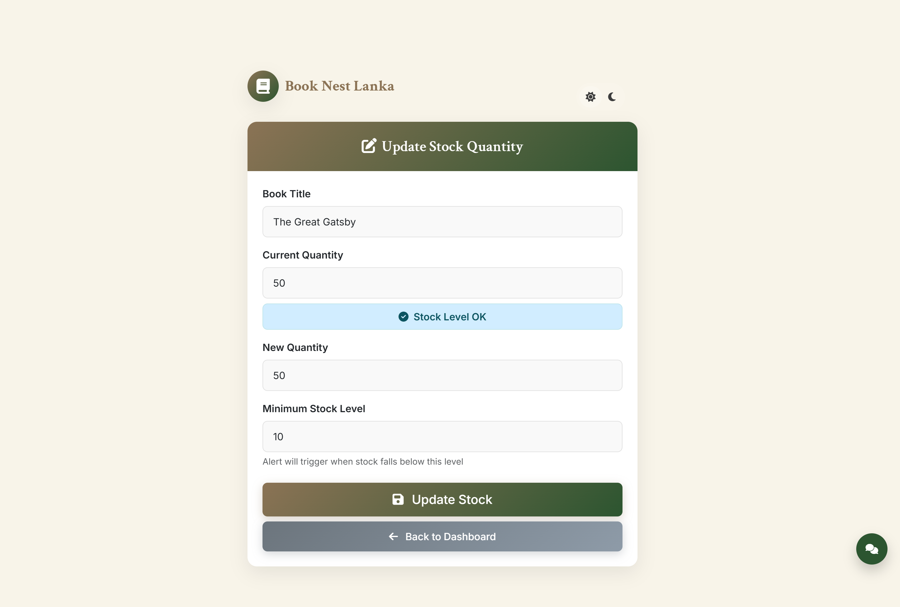
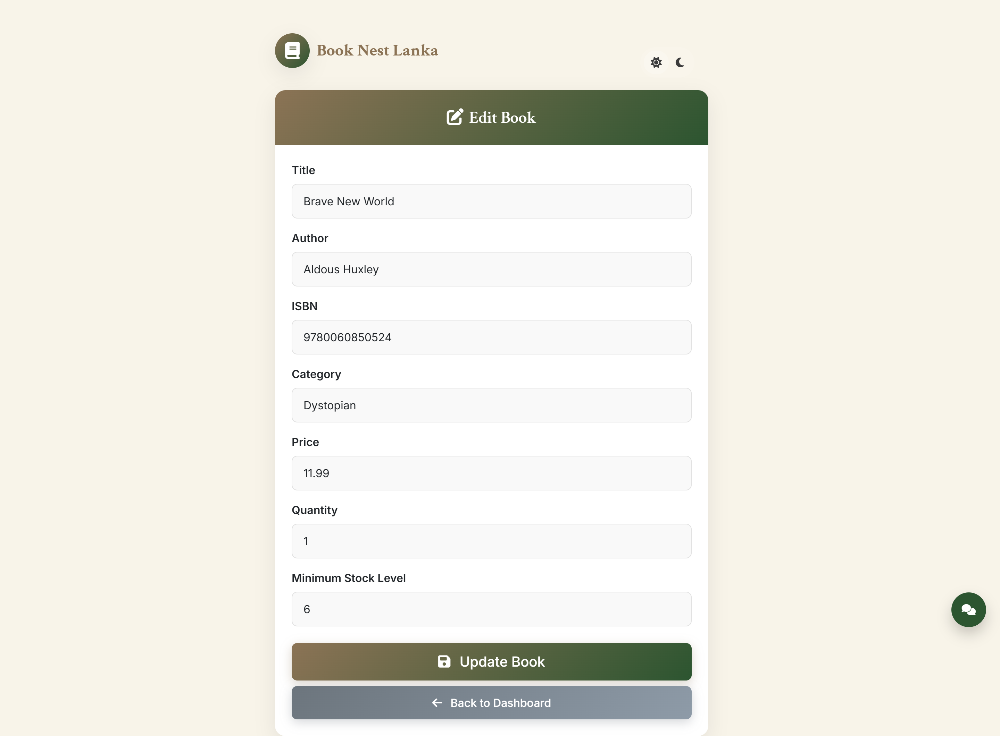
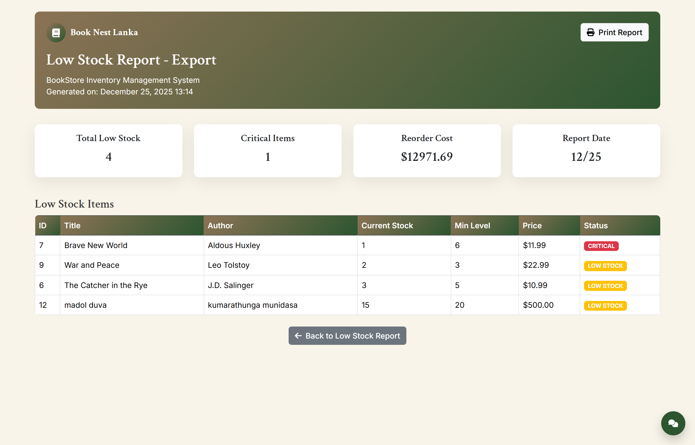
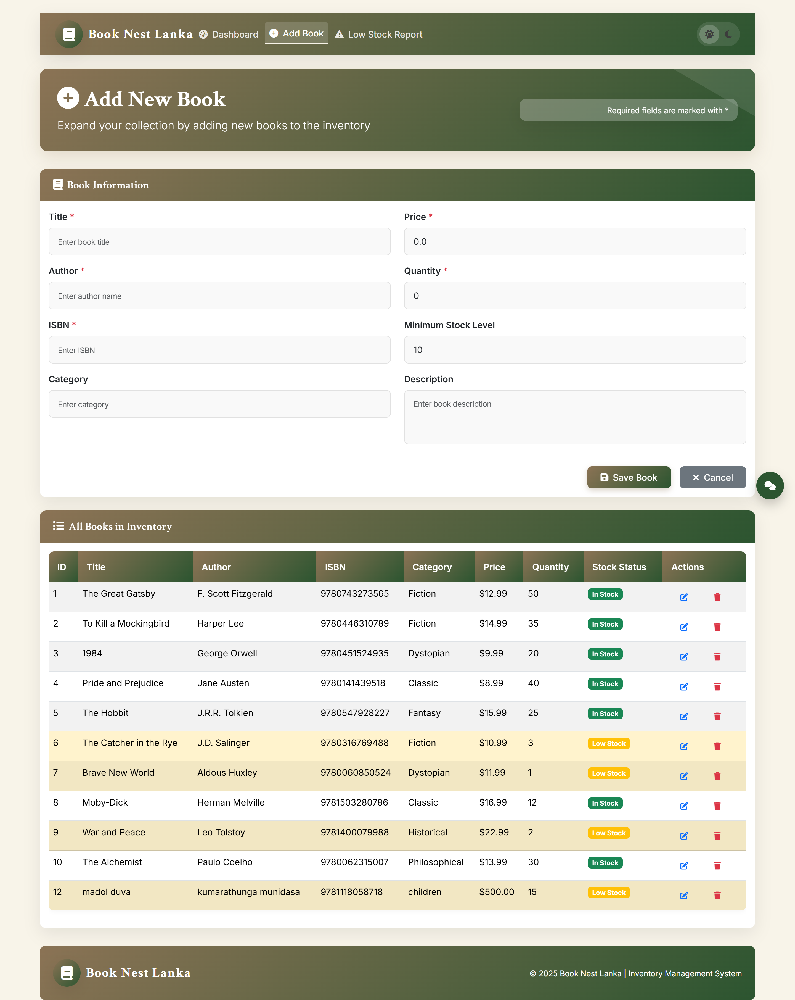
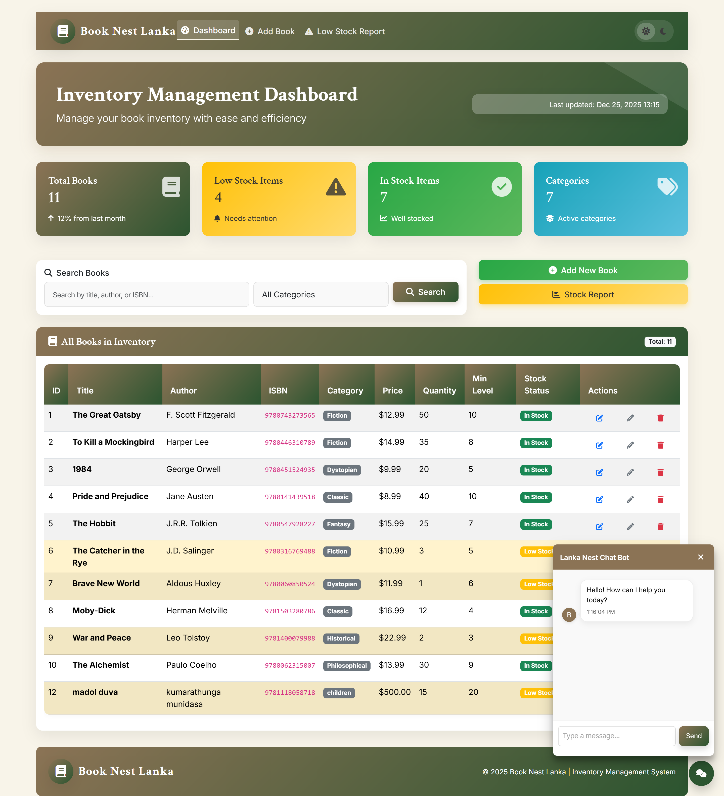
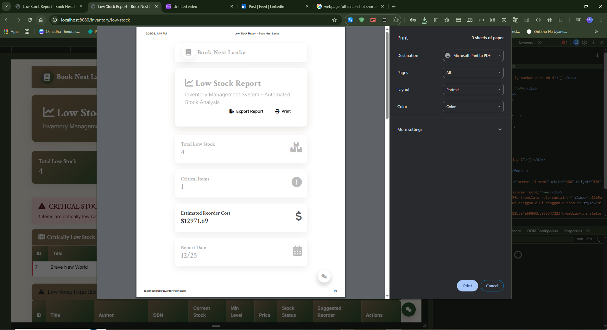

# Lanka Book Nest

## Overview

Lanka Book Nest is a comprehensive web-based inventory management system for a book warehouse, store, and delivery service. This project focuses on managing book stocks efficiently, including adding, updating, and deleting inventory items. It features a user-friendly dashboard for monitoring stock levels, generating reports for low and critical stocks, and categorizing books by name and type. Additionally, it integrates a machine learning-powered chatbot that assists users with queries such as warehouse location, opening times, book details search, and other basic needs. All data is stored in a MySQL database running on localhost.

The system is built using Java with Spring Boot for the backend, HTML and CSS for the frontend, and incorporates ML for the chatbot functionality. It also supports generating invoices and calculating total stock costs.

## Features

- **Inventory Management**: Add new books, update stock quantities, delete items, and set minimum stock levels with alerts for low/critical stock.
- **Stock Reports**: Generate low stock reports, critical stock alerts, and estimated reorder costs. Export and print reports.
- **Categorization**: Organize books by category (e.g., Fiction, Dystopian, Classic) and search by title, author, or ISBN.
- **Dashboard**: Overview of total books, low stock items, in-stock items, and categories. Includes real-time updates and search functionality.
- **Chatbot (ML-Powered)**: Integrated chatbot for user assistance, including:
  - Warehouse location and opening times.
  - Searching book details.
  - Basic queries related to inventory.
- **Invoice Generation**: Create and print invoices for stock management.
- **User Interface**: Responsive design with forms for editing books, updating stock, and viewing reports.

## Technologies Used

- **Backend**: Java, Spring Boot
- **Frontend**: HTML, CSS
- **Database**: MySQL (localhost server)
- **Machine Learning**: Integrated ML model for the chatbot (handles natural language queries for location, times, book search, etc.)
- **Other**: Localhost deployment for development

## Installation

1. **Clone the Repository**:
   ```
   git clone https://github.com/yourusername/lanka-book-nest.git
   ```

2. **Set Up MySQL Database**:
   - Install MySQL and create a database named `book_nest`.
   - Update the `application.properties` file in `src/main/resources` with your MySQL credentials:
     ```
     spring.datasource.url=jdbc:mysql://localhost:3306/book_nest
     spring.datasource.username=root
     spring.datasource.password=yourpassword
     spring.jpa.hibernate.ddl-auto=update
     ```

3. **Build and Run**:
   - Open the project in your IDE (e.g., IntelliJ or Eclipse).
   - Run the Spring Boot application:
     ```
     mvn spring-boot:run
     ```
   - Access the application at `http://localhost:8080`.

## Usage

- **Dashboard**: View overall inventory stats, search books, and navigate to add/update features.
- **Add Book**: Fill in details like title, author, ISBN, category, price, quantity, and min stock level.
- **Update Stock**: Select a book and adjust quantity; alerts trigger if below min level.
- **Low Stock Report**: View critical and low stock items, suggested reorders, and total costs.
- **Chatbot**: Interact via the chat interface for quick queries.
- **Generate Invoice/Report**: Export or print stock reports and invoices from the UI.

## Screenshots

### Update Stock Quantity


### Edit Book


### Low Stock Report - Export


### Add New Book


### Low Stock Report


### Inventory Management Dashboard


### Dashboard with Chatbot


### Print Invoice


*(Note: Replace `./screenshots/` with the actual path to your screenshot images in the repository.)*

## Contributing

Contributions are welcome! Please fork the repository and submit a pull request with your improvements. Ensure code follows standard Java and Spring Boot practices.

## License

This project created by H.M.Oshadha Thinura Kithmina

© 2025 Lanka Book Nest | Inventory Management System 
